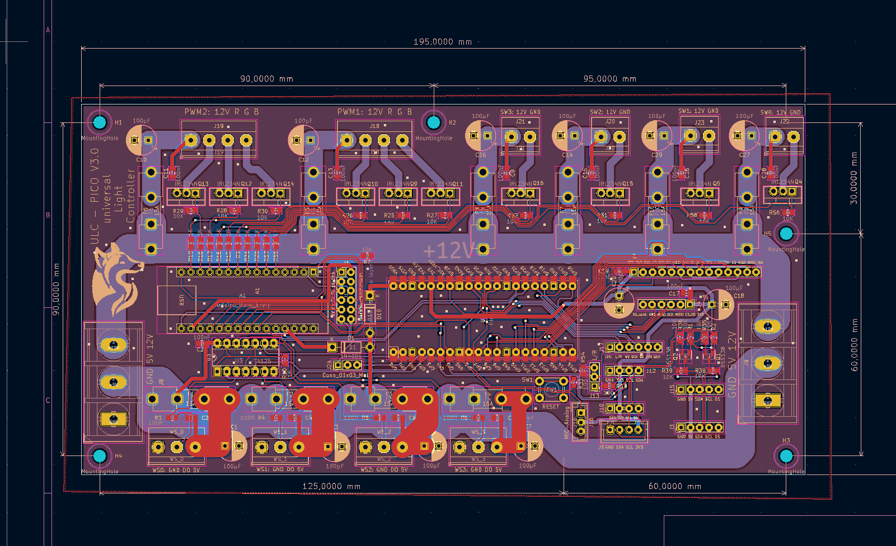
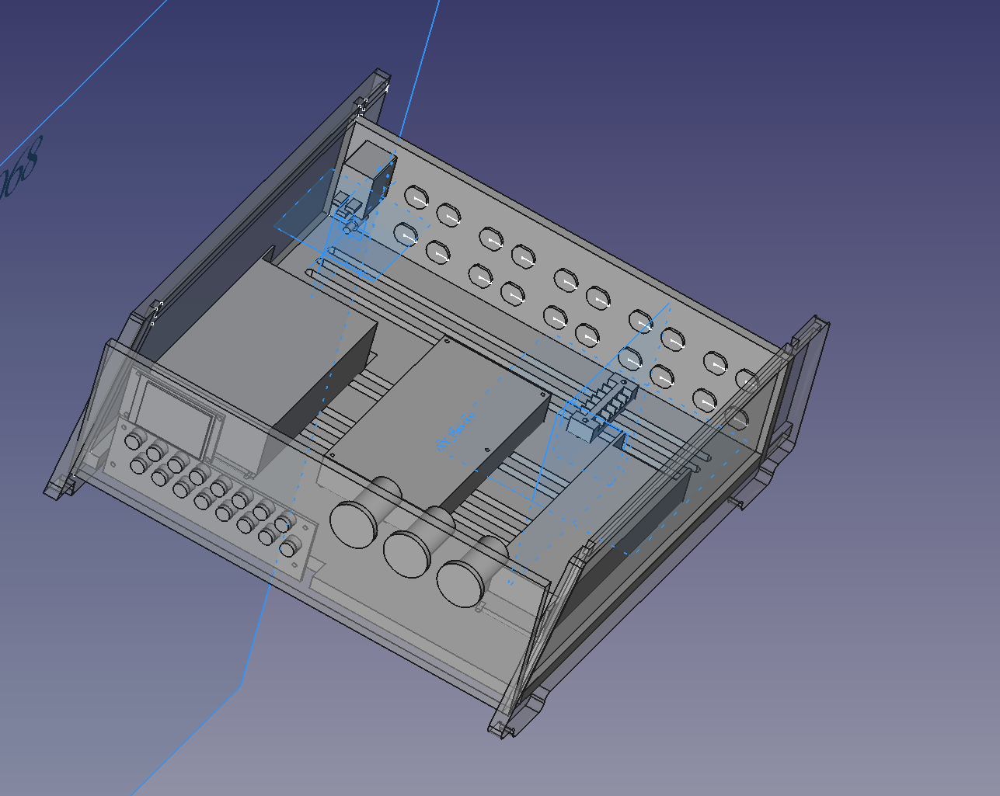
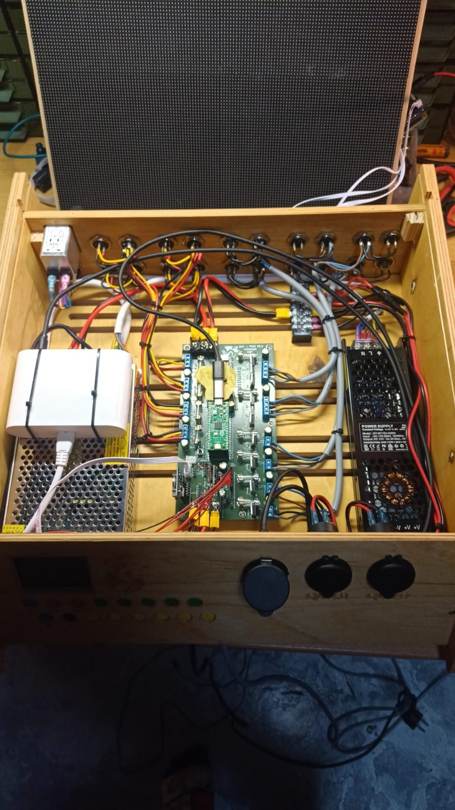
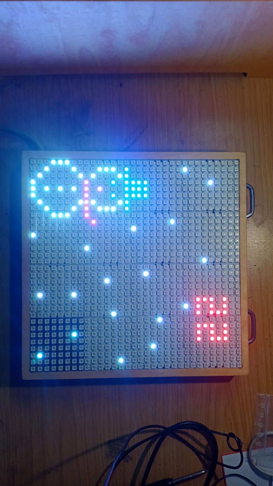
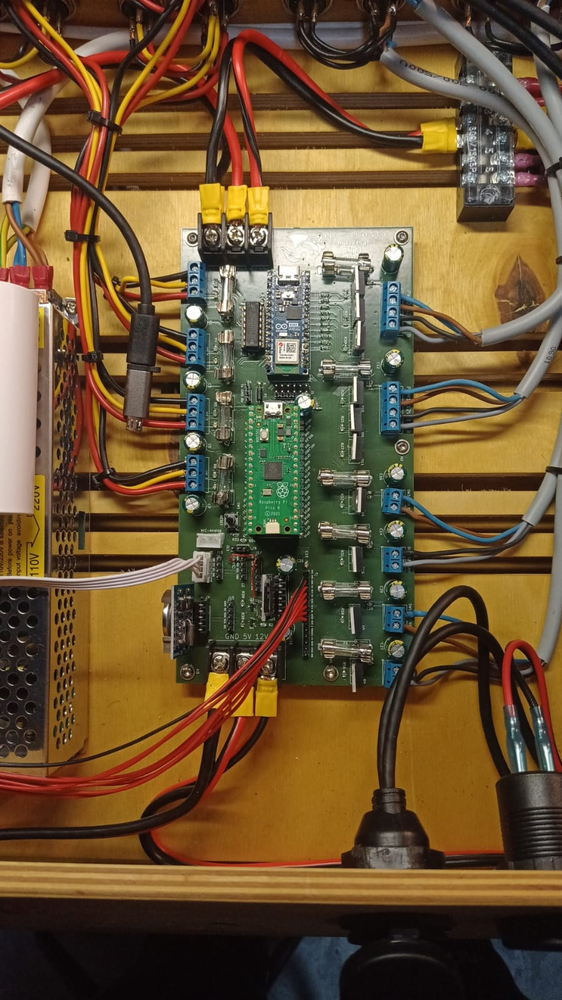
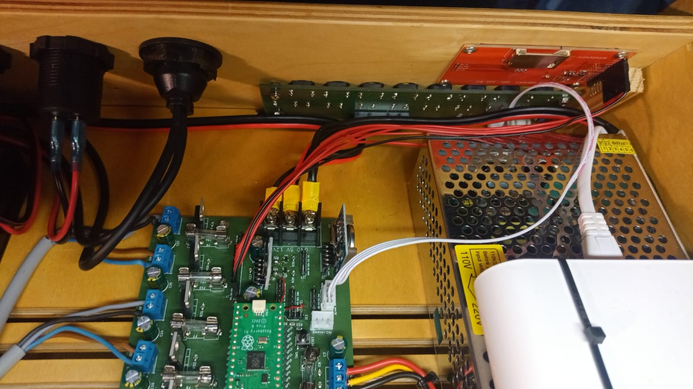
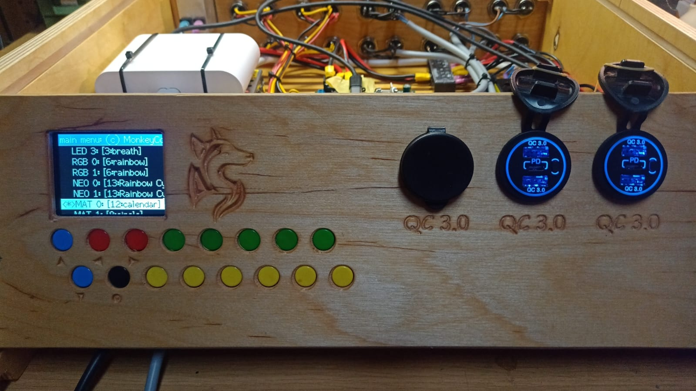
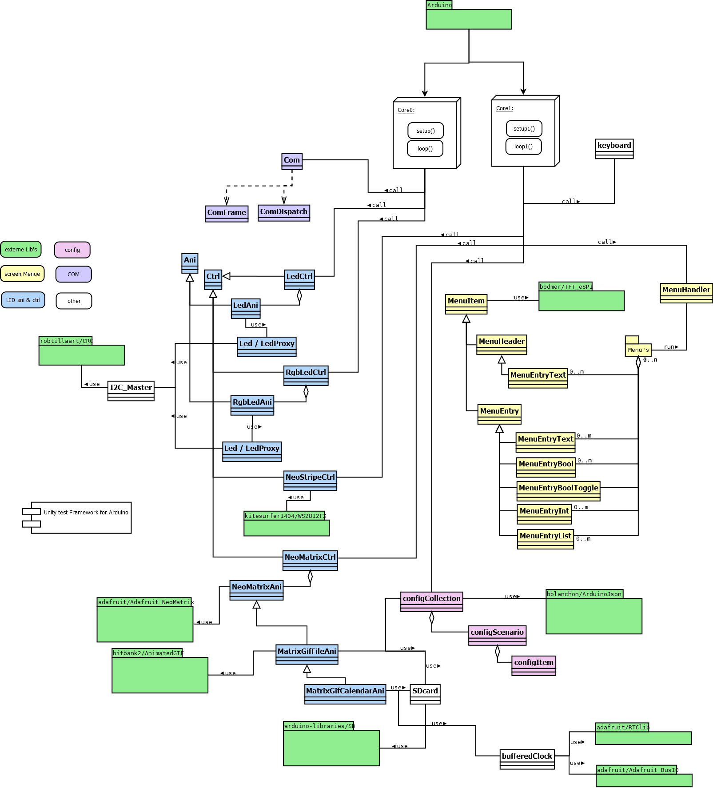

# **ULC Pico   (Universal Light Controller on Raspberry Pico)**

All started with the purchasing of Raspberry Pico RP2040 in 2023. 

a fascinating dual core processor for less than 5€ (gosh do you know what we have paied for Z80 or 68K when I started with µController) .. congratulation to the raspberry foundation good job

The Arduino IDE beacomes to small for this number files so I changed to Visual Studio Code with PlatformIO
.. fascinating all for free .. and the integration of RP2040 from maxgerhardt outstanding .. Thanks a lot

I tried several other things like:

+ Rapberry Pico Debuger 
+ Unity test
+ embedded dual core arcitecture With debugging 
+ LED stripes, RGB LED Stripes, WS2812B LED stripes, WS2812B LED Matrix
+ SD card
+ Advent calender
+ Real Time Clock
+ SPI Display
+ I2C Slave (Arduino Nano)
+ I2C keyboard
+ GIF animations of WS2812B Matrix
+ advent calendar with gifs


I just want to explore how it works and it lead to this  .. but it will not be the end, it just reached a state where I decided to make it public to give something back to the community, in the hope it may be usefull for somebody. 
And don’t forget: always stay curious and persistent. The best way to learn is through mistakes. But only those who try something new and unfamiliar can make mistakes to learn from. Every day without learning something is a lost day.

So, search behind every tree and under very stone for the three-headed monkey, and if you need a boat, just ask for Stan.


The project keeps growing and growing .. I needed a PCB .. I found KiCad :
@KiCad Team .. a professional layout tool for free .. great work ... 



there were now a lot of components so I needed a hosuing 
.. you will not belief there is a free M-CAD tool : freecad 



I build all in wood an milled it on my MP CNC (a nice free project for CNC machine please look for it)
And this is the final result:



and what can I do ?
----------------
mainly it control several types of LED (a lot of them)

one example a advent calendar for nurds:


some more details:





---

## **Table of Contents**
- [System architecture](#system-architecture)
- [Software architecture](#software-architecture)
- [Required Libraries](#required-libraries)
- [Installation](#installation)
- [Usage](#usage)
- [Configuration](#configuration)
- [Unit Test](#unit-test)
- [Contributing](#contributing)
- [License](#license)

---
## **System architecture**

---
## **Software architecture**


I staied with the Arduino loop concept and designed the most classes in this manner. This is not suitable for hard real time rqeuirement, but it is easy and with the performance of the two cores of the RP2040 it is amazing what is possible.

But from my experience I use during one loop run a fixed time (now). I freeze this time at the begin of the loop and pass it than to every module that is been called in this loop. 

In addition to that I have a favor for the rough concept of state-machine with init run etc... 


For more details please refer the comment of the individual classes.

ToDo description to : 
+ multi core problems - MUTEX handling 


---


## **Required Libraries**

Below is a list of the libraries or frameworks required for the project to run. Make sure to install them before proceeding.

Many thanks to all the amazing developers of these libraries. Based on this foundation, it is possible to create larger projects like this one with a moderate amount of time. This enables significantly more functionality than would have been achievable by a single person alone.


---

## **Installation**

### **Prerequisites**
- SW: 
+ install Visual Studio Code
+ in Visual Studio install PlatformIO extension
- HW:
+ Install Kicad 
- Mechanic:
+ Install freeCad

### **Steps**
1. clone this project from GitHub (you can use Visual Studio Code interface or download it per WEB interface)
   ```bash
   git clone https://github.com/MonkeyCodeMen/ULC-Pico-C-Code.git

---

## **Configuration**

ToDo

---

## **Unit Test**

ToDo

---

## **License**

The MIT License (MIT)

Copyright (c) 2024 MonkeyCodeMen@GitHub

Permission is hereby granted, free of charge, to any person obtaining a copy
of this software and associated documentation files (the "Software"), to deal
in the Software without restriction, including without limitation the rights
to use, copy, modify, merge, publish, distribute, sublicense, and/or sell
copies of the Software, and to permit persons to whom the Software is
furnished to do so, subject to the following conditions:

The above copyright notice and this permission notice shall be included in all
copies or substantial portions of the Software.

THE SOFTWARE IS PROVIDED "AS IS", WITHOUT WARRANTY OF ANY KIND, EXPRESS OR
IMPLIED, INCLUDING BUT NOT LIMITED TO THE WARRANTIES OF MERCHANTABILITY,
FITNESS FOR A PARTICULAR PURPOSE AND NONINFRINGEMENT. IN NO EVENT SHALL THE
AUTHORS OR COPYRIGHT HOLDERS BE LIABLE FOR ANY CLAIM, DAMAGES OR OTHER
LIABILITY, WHETHER IN AN ACTION OF CONTRACT, TORT OR OTHERWISE, ARISING FROM,
OUT OF OR IN CONNECTION WITH THE SOFTWARE OR THE USE OR OTHER DEALINGS IN THE
SOFTWARE.

have fun !!
